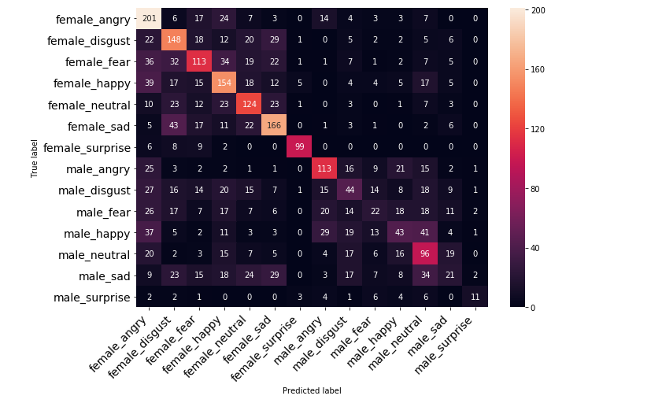
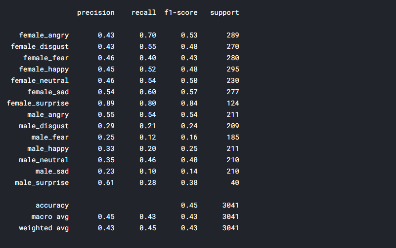

## Welcome to RAVDESS Emotional Speech Recognition Project

In this project, we explored, processed and trained a baseline CNN1D model for the RAVDESS dataset from kaggle: https://www.kaggle.com/uwrfkaggler/ravdess-emotional-speech-audio

### About the dataset:

filenames:
- Modality (01 = full-AV, 02 = video-only, 03 = audio-only).
- Vocal channel (01 = speech, 02 = song).
- Emotion (01 = neutral, 02 = calm, 03 = happy, 04 = sad, 05 = angry, 06 = fearful, 07 = disgust, 08 = surprised).
- Emotional intensity (01 = normal, 02 = strong). NOTE: There is no strong intensity for the 'neutral' emotion.
- Statement (01 = "Kids are talking by the door", 02 = "Dogs are sitting by the door").
- Repetition (01 = 1st repetition, 02 = 2nd repetition).
- Actor (01 to 24. Odd numbered actors are male, even numbered actors are female). So, here's an example of an audio filename. 02-01-06-01-02-01-12.mp4

This means the meta data for the audio file is:

- Video-only (02)
- Speech (01)
- Fearful (06)
- Normal intensity (01)
- Statement "dogs" (02)
- 1st Repetition (01)
- 12th Actor (12) - Female (as the actor ID number is even)

### Results
The accuracy from the baseline model is ~45%, which is not to shabby considering the model is classifying both the gender and the emotion.

Metrics for this project are as follows:

Confusion Matrix:

Other Metrics:

